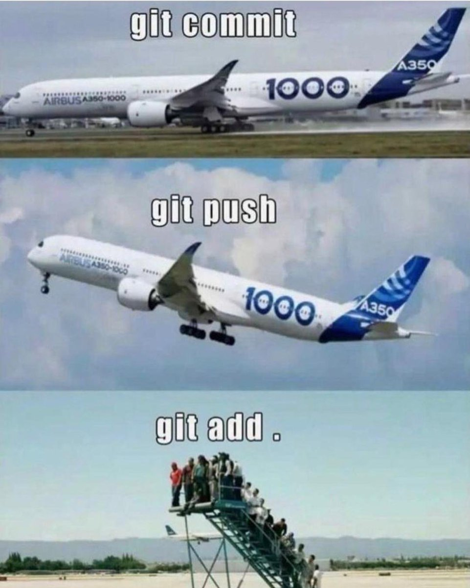

# Leica's User Page

`System.out.println("Hello!")`

My name is Jiawen Shen, and I go by Leica. This is my *second* year at **UCSD**. 
I am currently taking this amazing course ***CSE110*** with professor **Powell**. 

At the [end](#Task-List) of this page, I have listed all the core Markdown constructs I have used in this page and the screenshots for CSE110 Lab1 to make it easier to check what I have covered. 

And here is a link to [README.md](README.md) file in my repo. 

## Who am I?

### As a programmer: 

Here is a link to my [Github profile](https://github.com/jshen101) that could help introduce who am I as a programmer and what I have done before. 

I have a list of programming languages down below that I am proficiency at or familiar with now: 
- Java
- C++
- C
- R
- Python
- JavaScript
- LaTeX
- HTML
- CSS
- MATLAB
- git

I agree with the professor that "SWE is sponsored by Uncertainty" and 
> You can't reduce uncertainty without reducing innovation

Thus, I always keep actively learning new things and practicing what I have learned, hoping that it will help me deal with the unavoidable uncertainty I would meet in the future. 

Besides all the formal stuff, here is a meme that I love as a programmer: 

### As a person:

I really enjoy reading books and listening to music in my spare time. I found reading and listening can always make me feel less anxious and calm me down. 

Here is the top 5 artists I recently listening to (with 1 being most often): 
1. BLACKPINK
2. Taylor Swift
3. (G)I-DLE
4. Jay Chou
5. Eason Chan

## Task List
- [x] Pictures
- [x] Headings
- [x] Styling text
- [x] Quoting text
- [x] Quoting code
- [x] External Links
- [x] Section links
- [x] Relative links
- [x] Ordered Lists
- [x] Unordered Lists
- [x] Task lists
